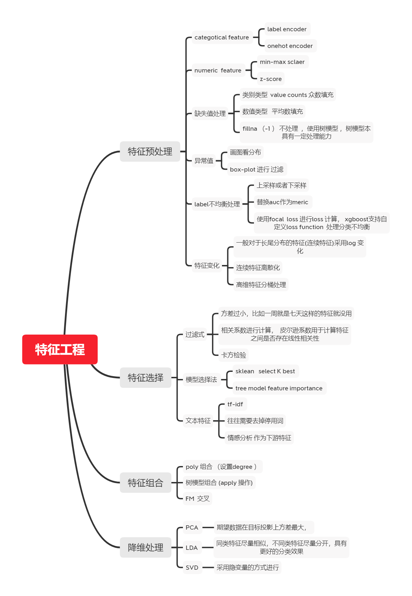

Thinking1   CTR数据中的类别数据处理，编码方式有哪些，区别是什么?
+ CTR数据中的类别数据处理有两种：label encoder , Onehot encoder , embedding 。label encoding方式进行编码的特征往往可以比较，比如vip等级等等，onehot 处理的特征往往不能进行比较，比如性别特征。而使用深度学习模型进行ctr预估的时候往往将类别特征进行embedding将数据转化为实数进行后续处理，对于不同（nunique size ）的数据采用不同的embedding size。

Thinking2   对于时间类型数据，处理方法有哪些?
+ 对于时间特征往往转化成DateTime 类型进行后续处理
+ 抽取时间的详细信息， 比如 年， 月， 旬 
+ 节日特征 ，是否常见假期
+ 是否工作日特征
+ 工作日的第几天,或者周末前第几天
+ 一天内的时间特征可以考虑是否上下班高峰等等，根据问题合理构造特征

Thinking3   你是如何理解CTR预估中的特征组合的，请举例说明？
+ CTR预估中的特征组合有：
    - GBDT + LR ，首次采用树模型进行自动特征交叉
    - FM ,工程上实现特征的二阶交叉，但是没有对特征进行划分Field 将特原来同属于同一field 信息丢失， 比如性别（onehot 编码之后成为两个特征独立于其他特征进行交叉 ，FFM 解决这个问题）
    + deepFM改良WDL模型wide 侧任需要人工特征工程， 将wide 侧改为FM实现低阶特征自动组合。
    + DCN 
    + xdeepfm 
+ 特征交叉可以可以挖掘更好高层次的特征。比如性别和年龄进行组合就可以产生很多特征比如16岁的少女，40岁的大妈，70岁的大爷等。

Thinking4：  DCN和xDeepFM都可以进行自动特征组合，有何区别？简要说明DCN，xDeepFM的原理，区别？
+  DCN提出了新的算子，用于得到交叉特征，与FM相比，DCN 拥有更高的计算效率并且能够提取到更高阶的交叉特征（bit-wise)。
+  xDeepFM 在DCN基础上进行了改进，交互特征是在vector-wise层 ,高维交互特征是显式的 ,网络的复杂度不会因为交互层级的增加而增加。
+ DCN 的Cross层接在Embedding层之后，虽然可以显式自动构造高阶特征，但它是以bit-wise的方式，没有Field的概念。xDeepFM将FM的vector-wise的思想引入Cross部分。
Thinking5：今天讲解的特征组合只是特征工程中的一部分，你理解的特征工程都包括哪些，不防做个思维导图 ？
+ 