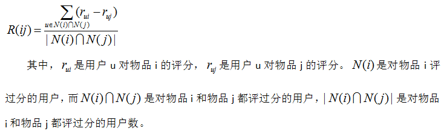
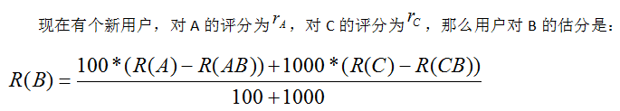

#### Slope One算法
+ Slope One 算法是由 Daniel Lemire 教授在 2005 年提出的一个Item-Based 的协同过滤推荐算法。和其它类似算法相比, 它的最大优点在于算法很简单, 易于实现, 执行效率高, 同时推荐的准确性相对较高。Slope One算法是基于不同物品之间的评分差的线性算法，预测用户对物品评分的个性化算法。
+ 算法三步：
	- Step1:计算物品之间的评分差的均值，记为物品间的评分偏差(两物品同时被评分)；
    
	- Step2:根据物品间的评分偏差和用户的历史评分，预测用户对未评分的物品的评分。
     
	- Step3:将预测评分排序，取topN对应的物品推荐给用户。
#### 加权算法 Weighted Slope One
+ 假设有100个人对物品A和物品B打分了，R(AB)表示这100个人对A和B打分的平均偏差;有1000个人对物品B和物品C打分了， R(CB)表示这1000个人对C和B打分的平均偏差；
    

####  应用场景
+ 该算法适用于物品更新不频繁，数量相对较稳定并且物品数目明显小于用户数的场景。比较依赖用户的用户行为日志和物品偏好的相关内容。
+ 其优点： 
    - 算法简单，易于实现，执行效率高 
    - 可以发现用户潜在的兴趣爱好；
- 其缺点：
    - 依赖用户行为，存在冷启动问题和稀疏性问题。

