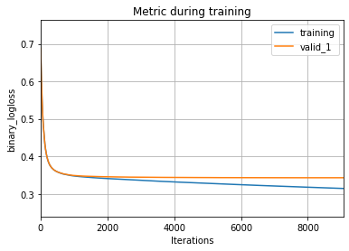

#### 详情参见Notebooks 
+ 数据来源
    +  https://aistudio.baidu.com/aistudio/competition/detail/22
    + 百度网盘 :数据集：https://pan.baidu.com/s/1YSE3nxaXXFC1G5_V1-h9ew 提取码：2b4m
+ 实验步骤
    + step0 赛题背景理解
    + step1 数据探索,EDA分析
    + step2 数据预处理
    + step3 lightgbm,xgboost预测
        + loss 曲线
        
    + step4 模型融合
+ 实验效果
    + 准确率达到85%

